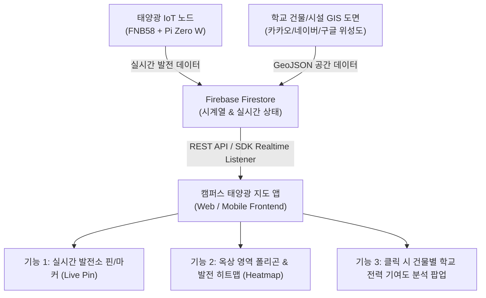

# 🗺️ 학교 태양광 발전 모니터링 & 캠퍼스 지도 앱 데이터 규격서 (Data Specification)

**문서 버전**: v1.0  
**최종 수정일**: 2026-09-04  
**적용 대상**: 캠퍼스 태양광 지도 웹/앱 프론트엔드 (Kakao Maps, Naver Maps, Google Maps, Leaflet, Mapbox 등) 및 백엔드(Firebase Firestore)

---

## 1. 개요 및 지도 앱 연동 아키텍처

본 규격서는 교내 태양광 발전기(FNB58 + 라즈베리파이)에서 수집된 시계열 발전 데이터와 교내 시설(옥상, 운동장 등)의 공간 정보(GIS/GeoJSON)를 결합하여, **지도 기반의 실시간 모니터링 및 전력 기여도 시뮬레이션 앱**을 제작하기 위한 표준 데이터 모델을 정의합니다.



---

## 2. 공간 좌표계 및 GeoJSON 표준

- **기본 좌표계**: **WGS84 (EPSG:4326)** (GPS 표준 위도/경도)
- **표기 형식**:
  - 지도 렌더링용: `[경도(Longitude), 위도(Latitude)]` (GeoJSON 표준 순서)
  - 단일 필드용: `latitude` (위도, Float), `longitude` (경도, Float)

---

## 3. Firestore 데이터베이스 모델 명세

### 컬렉션 1: `solar_stations` (설치 지점 메타데이터 & 실시간 상태)
지도 앱에서 **마커(Marker/Pin)**를 찍고 현재 발전 상태를 표시하기 위한 핵심 컬렉션입니다.

- **경로**: `/solar_stations/{stationId}`
- **문서 ID 예시**: `station_rooftop_main_01`, `station_playground_01`

#### 스키마 정의:
```typescript
interface SolarStation {
  station_id: string;          // 고유 지점 식별자 (예: "station_rooftop_main_01")
  name: string;                // 지점 이름 (예: "본관 옥상 1호기")
  category: "ROOFTOP" | "GROUND" | "WINDOW" | "PARKING" | "BALCONY"; // 설치 유형
  building_id: string;         // 연계 건물 ID (예: "bldg_main")
  building_name: string;       // 건물명 (예: "본관")
  floor: number;               // 설치 층수 (옥상은 최고층, 지상은 0)

  // 1. 공간 좌표 (GIS)
  location: {
    latitude: number;          // 위도 (예: 37.5665)
    longitude: number;         // 경도 (예: 126.9780)
    altitude_m?: number;       // 해발고도 또는 지상 높이(m)
  };

  // 2. 물리적 패널 제원
  hardware: {
    panel_model: string;       // 패널 모델명
    rated_power_w: number;     // 정격 용량(W) (예: 30)
    surface_area_m2: number;   // 패널 수광 면적 (m²) (예: 0.18)
    tilt_angle_deg: number;    // 설치 경사각 (도) (예: 30)
    azimuth_deg: number;       // 설치 방위각 (도) (예: 180: 정남향)
  };

  // 3. 실시간 발전 상태 (지도 마커 색상 및 팝업용 캐시)
  live_status: {
    state: "GENERATING" | "IDLE" | "OFFLINE" | "ERROR"; // 발전중/대기/오프라인/에러
    power_w: number;           // 실시간 현재 출력 (W)
    voltage_v: number;         // 현재 전압 (V)
    current_a: number;         // 현재 전류 (A)
    today_energy_wh: number;   // 금일 누적 발전량 (Wh)
    temp_c: number;            // 패널 온도 (°C)
    last_updated: string;      // ISO 8601 타임스탬프
  };

  // 4. 시스템 헬스
  telemetry: {
    pi_cpu_temp_c: number;     // 라즈베리파이 온도 (°C)
    wifi_rssi_dbm: number;     // Wi-Fi 신호 감도 (-30 ~ -90 dBm)
  };
}
```

---

### 컬렉션 2: `campus_polygons` (학교 건물 및 유휴지 공간 영역)
지도 위에 **건물 옥상 영역, 운동장, 주차장 폴리곤**을 그리고 면적 기반 잠재 발전량을 시뮬레이션하기 위한 GeoJSON 컬렉션입니다.

- **경로**: `/campus_polygons/{polygonId}`
- **문서 ID 예시**: `poly_bldg_main`, `poly_bldg_science`

#### 스키마 정의:
```typescript
interface CampusPolygonFeature {
  type: "Feature";
  id: string;                  // 폴리곤 ID (예: "poly_bldg_main")
  properties: {
    building_name: string;     // 건물명 (예: "본관동")
    total_roof_area_m2: number;// 총 옥상 면적 (m²) (예: 850.0)
    usable_solar_area_m2: number; // 태양광 유효 설치 면적 (통로/실외기 제외, 약 60~70%)
    current_installed_stations: string[]; // 연결된 station_id 목록
    
    // 시뮬레이션 파라미터 (학교 전력 기여도 계산용)
    potential_capacity_kw: number; // 옥상 풀 설치 시 예상 총 설비용량 (kW)
    monthly_consumption_kwh: number; // 해당 건물의 월간 평균 소비 전력량 (kWh)
  };
  geometry: {
    type: "Polygon";
    coordinates: number[][][]; // [[[경도, 위도], [경도, 위도], ...]] (외곽선 좌표 배열)
  };
}
```

---

### 컬렉션 3: `solar_logs` (1분 주기 시계열 계측 로그)
지도 앱에서 마커를 클릭했을 때 **일일 발전 추이 차트(시간대별 W 변화선)**를 그리기 위한 시계열 컬렉션입니다.

- **경로**: `/solar_logs/{autoId}`

#### 스키마 정의:
```typescript
interface SolarMinuteLog {
  station_id: string;          // 발전 지점 ID
  timestamp: FirebaseFirestore.Timestamp;
  iso_time: string;            // "2026-09-04T12:30:00+09:00"
  date: string;                // "2026-09-04"
  voltage_avg_v: number;       // 1분간 평균 전압 (V)
  current_avg_a: number;       // 1분간 평균 전류 (A)
  power_avg_w: number;         // 1분간 평균 출력 (W)
  power_max_w: number;         // 1분간 최고 출력 (W)
  energy_delta_wh: number;     // 해당 1분간 생산된 전력량 (Wh)
  temp_c: number;              // 패널 온도 (°C)
  sample_count: number;        // 유효 샘플 수 (약 50~60회)
}
```

---

### 컬렉션 4: `school_energy_summary` (학교 전체 전력 기여도 집계)
지도 앱 상단 헤더 또는 대시보드 요약 카드에 표시되는 **학교 전체 전력 자립률 및 탄소 절감량** 문서입니다.

- **경로**: `/school_energy_summary/latest`

#### 스키마 정의:
```typescript
interface SchoolEnergySummary {
  date: string;                // "2026-09-04"
  today_total_generation_kwh: number;   // 교내 실측 발전량 총합 (kWh)
  simulated_full_campus_kwh: number;    // 옥상 전면 설치 시 환산 발전량 (kWh)
  school_today_consumption_kwh: number; // 학교 금일 총 전기 사용량 (한전 데이터)
  
  // 핵심 성과 지표 (KPI)
  real_contribution_percent: number;    // 실제 실측 장비의 기여율 (%)
  simulated_self_sufficiency_percent: number; // 시뮬레이션 기반 전력 자립 기여율 (%)
  co2_reduced_kg: number;               // 탄소 저감량 (0.4781 kgCO2/kWh 환산)
  tree_planted_equivalent: number;      // 소나무 식재 환산 효과 (그루)
  last_updated: string;
}
```

---

## 4. 지도 앱 UI 상태 매핑 (마커 스타일 가이드)

지도 프론트엔드에서 `solar_stations`의 `live_status.state` 및 `power_w` 값에 따라 마커 색상을 분기합니다.

| 상태 (State) | 조건 | 추천 마커 색상 | 지도 핀 애니메이션 | 의미 |
| :--- | :--- | :--- | :--- | :--- |
| **GENERATING_HIGH** | `power_w >= rated_power_w * 0.7` | 🟢 초록 (`#10B981`) | 펄스(Pulse) 애니메이션 | 고출력 정상 발전 중 |
| **GENERATING_LOW** | `power_w > 0.5` | 🟡 노랑/주황 (`#F59E0B`) | 고정 | 저조도/흐림 발전 중 |
| **IDLE** | `power_w <= 0.5` | ⚪ 회색 (`#6B7280`) | 고정 | 야간 / 일몰 대기 |
| **OFFLINE** | 최근 업데이트 5분 초과 | 🔴 빨강 테두리 회색 | 깜빡임 경고 | 통신 끊김 / 장비 점검 요망 |

---

## 5. 실제 연동용 샘플 데이터 (Mock Payload)

지도 앱 개발 시 즉시 테스트에 활용할 수 있는 JSON 및 GeoJSON 예시입니다.

### 1) 지도 마커용 `solar_stations.json`
```json
[
  {
    "station_id": "station_rooftop_main_01",
    "name": "본관 옥상 실험 1호기",
    "category": "ROOFTOP",
    "building_id": "bldg_main",
    "building_name": "본관",
    "floor": 4,
    "location": {
      "latitude": 37.501234,
      "longitude": 127.039876,
      "altitude_m": 18.5
    },
    "hardware": {
      "panel_model": "Portable-Solar-30W",
      "rated_power_w": 30.0,
      "surface_area_m2": 0.18,
      "tilt_angle_deg": 30,
      "azimuth_deg": 180
    },
    "live_status": {
      "state": "GENERATING",
      "power_w": 21.45,
      "voltage_v": 5.12,
      "current_a": 4.19,
      "today_energy_wh": 112.5,
      "temp_c": 34.2,
      "last_updated": "2026-09-04T13:45:00+09:00"
    },
    "telemetry": {
      "pi_cpu_temp_c": 46.8,
      "wifi_rssi_dbm": -62
    }
  },
  {
    "station_id": "station_playground_01",
    "name": "운동장 스탠드 2호기",
    "category": "GROUND",
    "building_id": "bldg_field",
    "building_name": "운동장",
    "floor": 1,
    "location": {
      "latitude": 37.501890,
      "longitude": 127.040500,
      "altitude_m": 0.0
    },
    "hardware": {
      "panel_model": "Portable-Solar-30W",
      "rated_power_w": 30.0,
      "surface_area_m2": 0.18,
      "tilt_angle_deg": 0,
      "azimuth_deg": 180
    },
    "live_status": {
      "state": "GENERATING",
      "power_w": 18.20,
      "voltage_v": 5.08,
      "current_a": 3.58,
      "today_energy_wh": 95.8,
      "temp_c": 36.1,
      "last_updated": "2026-09-04T13:45:00+09:00"
    },
    "telemetry": {
      "pi_cpu_temp_c": 48.1,
      "wifi_rssi_dbm": -71
    }
  }
]
```

### 2) 캠퍼스 옥상 영역 `campus_rooftop_polygons.geojson`
```json
{
  "type": "FeatureCollection",
  "features": [
    {
      "type": "Feature",
      "id": "poly_bldg_main",
      "properties": {
        "building_name": "본관 옥상 유휴지",
        "total_roof_area_m2": 850.0,
        "usable_solar_area_m2": 550.0,
        "potential_capacity_kw": 82.5,
        "monthly_consumption_kwh": 12500.0,
        "simulated_monthly_generation_kwh": 9900.0,
        "expected_offset_percent": 79.2
      },
      "geometry": {
        "type": "Polygon",
        "coordinates": [
          [
            [127.039600, 37.501100],
            [127.040100, 37.501100],
            [127.040100, 37.501400],
            [127.039600, 37.501400],
            [127.039600, 37.501100]
          ]
        ]
      }
    }
  ]
}
```

---

## 6. 프론트엔드 연동 가이드 (JavaScript/TypeScript 예시)

지도 앱에서 Firestore의 실시간 변경 사항을 수신하여 핀 상태를 갱신하는 기본 스니펫:

```javascript
import { initializeApp } from "firebase/app";
import { getFirestore, collection, onSnapshot } from "firebase/firestore";

const db = getFirestore(app);

// 1. 실시간 발전기 마커 리스너 등록
onSnapshot(collection(db, "solar_stations"), (snapshot) => {
  snapshot.docChanges().forEach((change) => {
    const station = change.doc.data();
    const { latitude, longitude } = station.location;
    const { power_w, state } = station.live_status;

    // 카카오맵 / 네이버맵 / 구글맵 마커 인스턴스 갱신
    updateMapMarker(station.station_id, latitude, longitude, power_w, state);
  });
});

function updateMapMarker(id, lat, lng, power, state) {
  // 예: 카카오맵 마커 이미지 및 인포윈도우 업데이트
  console.log(`[Marker Updated] ${id} 위치 (${lat}, ${lng}) - 현재 출력: ${power}W [${state}]`);
}
```
