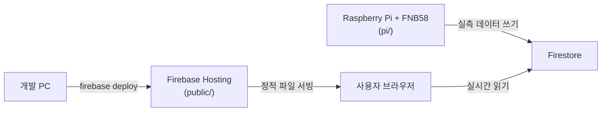

# SolarMaps 운영 가이드 (설치 · 업데이트 · Pi 노드)

이 문서는 SolarMaps를 **처음 배포할 때**, **이미 배포된 것을 갱신할 때**,
**Raspberry Pi 실측 노드를 설치/운영할 때** 그대로 따라 할 수 있는 순서를
정리한 것이다. 각 항목의 배경/원리는 다음 문서에 더 자세히 있다:

- Firebase 프로젝트를 아예 처음 만드는 절차 → [SETUP.md](SETUP.md)
- Firestore 데이터 스키마 → [DATA_SPEC.md](DATA_SPEC.md)
- 물리 모델(계산 엔진) → [MODEL.md](MODEL.md)
- Pi 노드 코드 자체의 상세 설명 → [../pi/README.md](../pi/README.md)

## 0. 구성 한눈에 보기



- **웹 앱**(`public/`): Firebase Hosting이 정적 파일로 서빙. 지도·계산 엔진(Pyodide)은
  브라우저에서 전부 돌아가고, 서버 쪽 로직은 없다.
- **Firestore**: 웹 앱은 읽기만 하고, 쓰기는 Pi 쪽 서비스 계정(Admin SDK/REST)만 가능
  (`firestore.rules` 참고).
- **Pi 노드**(`pi/`): 별도로 배포되는 완전히 독립된 파이썬 스크립트. 웹 앱과 코드를
  공유하지 않고 Firestore를 통해서만 연결된다.

즉 "서버"라고 부를 만한 건 Firebase Hosting/Firestore(관리형, 코드 없음)와
Pi 노드(직접 관리하는 상시 실행 프로세스) 두 곳이다. 아래 1장은 전자, 3장은 후자를 다룬다.

---

## 1. 최초 설치 (웹 앱)

### 1.1 로컬 개발 환경

```bash
git clone <이 저장소 URL> SolarMaps
cd SolarMaps

python -m venv venv
venv/Scripts/pip install -r requirements.txt   # Windows
# venv/bin/pip install -r requirements.txt      # macOS/Linux
```

### 1.2 Firebase 프로젝트 생성

아직 Firebase 프로젝트가 없다면 [SETUP.md](SETUP.md) §1~4를 따라:
1. Firebase 콘솔에서 프로젝트 생성 (Spark 무료 요금제로 충분)
2. 웹 앱 등록 → `firebaseConfig`를 [public/js/firebase-config.js](../public/js/firebase-config.js)에 붙여넣기
3. Firestore 활성화 (리전 `asia-northeast3` 권장)
4. Firebase CLI 로그인 후 `.firebaserc`의 `REPLACE_WITH_YOUR_PROJECT_ID`를 실제 프로젝트 ID로 교체

```bash
npm install -g firebase-tools
firebase login
```

### 1.3 최초 빌드

쾨펜 기후 격자와 Pyodide용 계산 엔진 zip을 생성한다. 둘 다 git에 커밋하지 않으므로
**클론 직후에는 반드시 한 번 실행**해야 한다 (`public/data/`, `public/py/`가 비어 있음):

```bash
venv/Scripts/python scripts/build.py
```

### 1.4 로컬에서 확인

```bash
venv/Scripts/python -m http.server 8080 --directory public
```

http://localhost:8080 접속 → 지도 클릭 → 결과 패널에 경사각/방위각이 나오는지 확인.
(이 단계는 Firebase 배포 없이도 동작한다 — 계산 엔진은 브라우저에서 자체 실행되므로.)

### 1.5 Firestore 규칙 배포

```bash
firebase deploy --only firestore:rules,firestore:indexes
```

### 1.6 (선택) 목업 데이터로 대시보드 확인

실제 Pi 노드 없이 마커/대시보드 카드가 뜨는지 먼저 확인하고 싶다면:

```bash
# Firebase 콘솔 → 프로젝트 설정 → 서비스 계정 → 새 비공개 키 생성 → serviceAccountKey.json으로 저장
venv/Scripts/python scripts/seed_firestore.py
```

### 1.7 웹 호스팅 배포

```bash
firebase deploy --only hosting
```

배포된 URL(`https://<project-id>.web.app`)에서 지도 클릭 → 마커 표시까지 전부 되는지 최종 확인한다.

---

## 2. 업데이트 (이미 배포된 앱 갱신)

코드를 수정한 뒤 다시 배포할 때의 순서다.

### 2.1 코드 받기 / 변경

```bash
git pull   # 협업 중이라면
```

### 2.2 로컬에서 먼저 검증

```bash
venv/Scripts/python -m pytest tests/ -v
venv/Scripts/python -m http.server 8080 --directory public   # 눈으로 확인
```

UI만 건드렸다면 데스크탑/모바일 두 폭 모두 확인 (`#side-panel`이 카드 4개+대시보드를
한 스크롤 박스로 담고 있음 — 새 카드를 추가했다면 스크롤이 여전히 잘 동작하는지 확인).

### 2.3 캐시 버스팅 — CSS/JS를 고쳤다면 필수

`firebase.json`이 `**/*.@(js|css)`에 `Cache-Control: max-age=3600`(1시간)을 걸어둔다.
즉 CSS/JS 파일 내용만 바꾸고 그대로 배포하면, 이미 접속했던 사용자 브라우저는
**최대 1시간 동안 옛 파일을 계속 씀**. [index.html](../public/index.html)에서
쿼리스트링 버전을 올려 강제로 새로 받게 한다:

```html
<link rel="stylesheet" href="css/theme.css?v=3" />   <!-- v=2 → v=3 -->
<link rel="stylesheet" href="css/app.css?v=3" />
<link rel="stylesheet" href="css/map.css?v=3" />
```

`index.html` 자체는 `firebase.json`에서 캐시 규칙이 없어 매번 새로 받으므로,
저 숫자만 올리면 CSS/JS도 즉시 갱신된다. JS 모듈(`main.js` 등)은 코드에서
버전 쿼리를 안 쓰고 있으니, JS 로직을 바꿨는데 반영이 안 되는 것 같으면
같은 방식으로 `<script type="module" src="js/main.js?v=..."></script>`에도
버전을 붙이는 걸 검토한다.

### 2.4 쾨펜/계산 엔진을 고쳤다면 재빌드

`solarmaps/`(계산 엔진) 또는 `scripts/build_koppen.py`/`build_pyodide_bundle.py`가
건드리는 원본 데이터를 고쳤다면:

```bash
venv/Scripts/python scripts/build.py
```

`public/py/solarmaps.zip`은 `Cache-Control: max-age=300`(5분)만 걸려 있어 큰 문제는
아니지만, `public/data/*.bin`은 `max-age=86400`(1일)이라 급하게 반영해야 하면
파일명 자체를 바꾸거나(빌드 스크립트 수정) `firebase.json` 캐시 설정을 참고한다.

### 2.5 배포

```bash
firebase deploy --only hosting
```

`firestore.rules`나 `firestore.indexes.json`을 바꾼 경우에만 별도로:

```bash
firebase deploy --only firestore:rules,firestore:indexes
```

(두 가지를 동시에 배포해도 무방: `firebase deploy`만 실행하면 hosting+firestore 전체를 배포한다.)

---

## 3. Raspberry Pi 노드 가이드 (FNB58 실측)

전체 코드/설계는 [pi/](../pi/) 참고. 여기서는 설치·운영 순서만 정리한다.

### 3.1 준비물

- Raspberry Pi (Zero W 이상, Wi-Fi 필요) + Raspberry Pi OS
- FNIRSI FNB58 USB-C 파워미터
- 태양광 패널(예: Portable-Solar-30W) + USB 출력 케이블
- Firebase 서비스 계정 키(JSON) — [SETUP.md](SETUP.md) §5 참고, **절대 git에 커밋하지 않음**

### 3.2 최초 설치

Pi에서 `pi/` 폴더만 있으면 된다 (저장소 전체를 클론해도 되고, `pi/`만 scp로 복사해도 됨):

```bash
sudo apt install -y python3-venv iw
scp -r pi/ pi@<Pi IP>:/home/pi/solarmaps-pi     # 또는 Pi에서 직접 git clone
ssh pi@<Pi IP>
cd /home/pi/solarmaps-pi

python3 -m venv venv
venv/bin/pip install -r requirements.txt

sudo usermod -aG plugdev $USER    # FNB58(/dev/hidraw*) 접근 권한 — 재로그인 필요

cp config.example.json config.json
# config.json 편집: station.* (이 노드의 위치/패널 정보), firebase.service_account_path
```

서비스 계정 키 JSON을 `config.json`이 가리키는 경로(기본값 `serviceAccountKey.json`)로 올려둔다.

### 3.3 연결 확인 (하드웨어 없이 → 실기 순서로)

```bash
# 1) 하드웨어 없이 파이프라인만 확인 — config.json의 device.mode를 "simulator"로 두고
venv/bin/python main.py config.json
# Firestore 콘솔에서 solar_stations/{station_id} 문서가 갱신되는지, 지도 앱에 마커가 뜨는지 확인

# 2) FNB58을 USB로 연결한 뒤 단발 측정 확인
venv/bin/python vendor/openfnb58/fnb58.py --once

# 3) 값이 정상이면 config.json의 device.mode를 "fnb58"로 바꾸고 다시 실행
venv/bin/python main.py config.json
```

### 3.4 부팅 시 자동 실행 (systemd)

```bash
sudo cp solarmaps-pi.service /etc/systemd/system/
sudo systemctl daemon-reload
sudo systemctl enable --now solarmaps-pi
journalctl -u solarmaps-pi -f      # 로그 확인, Ctrl+C로 종료
```

### 3.5 업데이트 (Pi 쪽 코드를 고친 뒤)

```bash
ssh pi@<Pi IP>
cd /home/pi/solarmaps-pi
git pull                                   # git clone으로 설치했다면
# 또는: 새 pi/ 폴더를 다시 scp로 덮어쓰기 (config.json, serviceAccountKey.json은 보존)

venv/bin/pip install -r requirements.txt   # requirements.txt가 바뀐 경우만
sudo systemctl restart solarmaps-pi
journalctl -u solarmaps-pi -f              # 정상 기동 확인
```

`vendor/openfnb58/fnb58.py`는 [OpenFNB58](https://github.com/yeckel/OpenFNB58)에서
그대로 가져온 파일이라 우리가 직접 고치지 않는다 — 업스트림이 갱신되면 그 저장소에서
새로 받아 통째로 교체하면 된다 (`pi/vendor/openfnb58/ORIGIN.md` 참고, 라이선스는 GPLv3).

### 3.6 자주 겪는 문제

| 증상 | 확인할 것 |
| :--- | :--- |
| 지도 마커가 `OFFLINE`(빨강)으로 표시됨 | Pi가 실행 중인지(`journalctl -u solarmaps-pi`), Wi-Fi 연결(`iw dev wlan0 link`), `last_updated`가 5분 넘게 갱신 안 되면 앱이 자동으로 OFFLINE 처리함(§4, DATA_SPEC.md) |
| `FNB58 HID device not found` | USB 케이블 연결 확인, `lsusb`로 `2e3c:5558` 보이는지 확인, `plugdev` 그룹 추가 후 재로그인했는지 확인 |
| Firestore 쓰기 실패 로그 | `service_account_path` 경로/파일 존재 확인, 서비스 계정 키가 만료/삭제되지 않았는지 Firebase 콘솔에서 확인, Pi의 시각(`date`)이 맞는지 확인(TLS 핸드셰이크가 시각에 민감) |
| 값이 이상하게 크거나 0만 나옴 | `vendor/openfnb58/fnb58.py --once`로 단독 확인 — 원본 라이브러리 자체 문제인지, 우리 어댑터(`readers/fnb58.py`) 문제인지 구분 |

---

## 4. 요약 체크리스트

**최초 설치**: venv → Firebase 프로젝트 생성/연결 → `scripts/build.py` → 로컬 확인 →
`firestore:rules,indexes` 배포 → (선택) 시드 → `hosting` 배포

**업데이트**: pull → 테스트/로컬 확인 → (CSS/JS 고쳤으면 `?v=` 올리기) →
(데이터/엔진 고쳤으면 `build.py` 재실행) → `firebase deploy`

**Pi 최초 설치**: `pi/` 복사 → venv → `plugdev` 그룹 → `config.json` 작성 →
시뮬레이터로 파이프라인 확인 → FNB58 단독 확인 → `fnb58` 모드 전환 → systemd 등록

**Pi 업데이트**: pull/재복사(설정 파일 보존) → 의존성 재설치 → `systemctl restart` → 로그 확인
